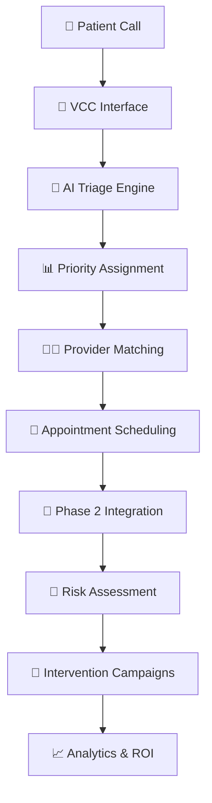

# 📁 Project Structure

## 🏗️ **Complete Healthcare System Architecture**

```
CascadeProjects/
├── 📋 README.md                           # Main project documentation
├── 🚀 start_complete_system.sh           # Start entire system
├── 🛑 stop_complete_system.sh            # Stop entire system
├── 📊 COMPLETE_SYSTEM_OVERVIEW.md        # Detailed system overview
├── 📁 PROJECT_STRUCTURE.md               # This file
├── 🔧 .gitignore                         # Git ignore rules
│
├── 🏥 phase1-scheduling-system/           # Phase 1: Triage & Scheduling
│   ├── 📋 README.md                      # Phase 1 documentation
│   ├── 🚀 start.sh                       # Start Phase 1 only
│   ├── 📦 requirements.txt               # Python dependencies
│   ├── 🧪 test_complete_system.py        # Integration tests
│   │
│   ├── 🐍 app/                           # Main application code
│   │   ├── 🔧 __init__.py
│   │   ├── 🌐 main.py                    # FastAPI application
│   │   ├── 📊 models.py                  # Pydantic data models
│   │   ├── 💾 storage.py                 # Text file storage system
│   │   ├── 🧠 triage_engine.py           # AI triage assessment
│   │   └── 📅 scheduling_engine.py       # Provider matching & scheduling
│   │
│   ├── 🗄️ storage/                       # Text file data storage
│   │   ├── 👥 users.txt                  # User accounts
│   │   ├── 👨‍⚕️ doctors.txt                # Doctor profiles
│   │   ├── 🏥 patients.txt               # Patient profiles
│   │   ├── 📅 appointments.txt           # Appointment records
│   │   └── 🩺 triage_assessments.txt     # Triage results
│   │
│   ├── 📊 data/                          # Reference data
│   │   └── 🩺 triage_protocols.csv       # OBGYN clinical protocols
│   │
│   ├── 🎨 integrated_frontend/           # Modern web interface
│   │   ├── 🌐 index.html                 # Main integrated interface
│   │   ├── 🧪 simple.html                # Simple test interface
│   │   ├── 🔧 debug.html                 # Debug interface
│   │   └── ⚡ integrated-app.js          # Frontend JavaScript
│   │
│   └── 🖥️ vcc_interface/                 # VCC agent interface
│       └── 🌐 index.html                 # Original VCC interface
│
├── 🎯 patient-noshow-prevention/         # Phase 2: No-Show Prevention
│   ├── 📋 README.md                      # Phase 2 documentation
│   ├── 🚀 start.sh                       # Start Phase 2 only
│   ├── 📦 requirements.txt               # Python dependencies
│   ├── 🐳 docker-compose.yml             # Docker services
│   ├── 🧪 test_noshow_api.py             # API tests
│   │
│   ├── 🐍 app/                           # Main application code
│   │   ├── 🔧 __init__.py
│   │   ├── 🌐 main.py                    # FastAPI application
│   │   ├── 📊 models.py                  # SQLAlchemy models
│   │   ├── 📊 schemas.py                 # Pydantic schemas
│   │   ├── 💾 database.py                # Database configuration
│   │   ├── 🤖 ml_model.py                # XGBoost ML model
│   │   ├── 📱 interventions.py           # Intervention campaigns
│   │   ├── 📞 communication.py           # SMS/Email services
│   │   └── 📈 analytics.py               # Performance analytics
│   │
│   ├── 🔗 integration_examples/          # Integration code examples
│   │   ├── 🔌 phase1_integration.py      # Phase 1 → Phase 2 calls
│   │   ├── 🪝 webhook_handler.py         # Webhook endpoints
│   │   ├── 🗄️ database_integration.sql   # DB trigger integration
│   │   └── 🧪 phase1_sample_code.py      # Sample integration code
│   │
│   └── 📚 docs/                          # Documentation
│       ├── 🔗 INTEGRATION_GUIDE.md       # Integration documentation
│       ├── 👥 FRIEND_INTEGRATION_PACKAGE.md # Developer guide
│       ├── ✅ COORDINATION_CHECKLIST.md   # Project coordination
│       ├── 📊 COMPLETE_SYSTEM_OVERVIEW.md # System overview
│       └── 🛠️ TECH_STACK.md              # Technology documentation
│
└── 🗑️ integrated-healthcare-frontend/    # Original AlignWell integration
    └── 📁 src/                           # React components (archived)
        ├── 🎨 components/                # AlignWell React components
        └── 🔧 services/                  # API integration services
```

## 🔄 **Data Flow Architecture**



## 🎯 **Component Responsibilities**

### **Phase 1: Smart Triage & Scheduling**
| Component | Responsibility | Technology |
|-----------|---------------|------------|
| `main.py` | FastAPI web server & routing | FastAPI |
| `triage_engine.py` | AI-powered symptom assessment | RAG + LLM |
| `scheduling_engine.py` | Provider matching & booking | Multi-criteria optimization |
| `storage.py` | Text file data persistence | JSON + File I/O |
| `integrated_frontend/` | Modern web interface | HTML + JavaScript |

### **Phase 2: No-Show Prevention**
| Component | Responsibility | Technology |
|-----------|---------------|------------|
| `main.py` | FastAPI web server & API | FastAPI |
| `ml_model.py` | Risk prediction model | XGBoost + scikit-learn |
| `interventions.py` | Tiered intervention campaigns | Celery + Redis |
| `communication.py` | Multi-channel messaging | Twilio + SendGrid |
| `analytics.py` | Performance tracking & ROI | PostgreSQL + Analytics |

## 🚀 **Deployment Architecture**

### **Development Environment**
```
┌─────────────────┐    ┌─────────────────┐
│   Phase 1       │    │   Phase 2       │
│   Port 3000     │◄──►│   Port 8000     │
│   Text Files    │    │   PostgreSQL    │
└─────────────────┘    └─────────────────┘
         │                       │
         └───────────────────────┘
                    │
            ┌─────────────────┐
            │  Integrated     │
            │  Frontend       │
            │  (Served by P1) │
            └─────────────────┘
```

### **Production Environment**
```
┌─────────────────┐    ┌─────────────────┐
│   Load Balancer │    │   Load Balancer │
│   (Nginx)       │    │   (Nginx)       │
└─────────────────┘    └─────────────────┘
         │                       │
┌─────────────────┐    ┌─────────────────┐
│   Phase 1       │    │   Phase 2       │
│   (Docker)      │◄──►│   (Docker)      │
│   PostgreSQL    │    │   PostgreSQL    │
└─────────────────┘    └─────────────────┘
```

## 📊 **File Sizes & Complexity**

| Component | Files | Lines of Code | Complexity |
|-----------|-------|---------------|------------|
| Phase 1 Core | 5 | ~2,000 | High |
| Phase 2 Core | 8 | ~3,500 | Very High |
| Frontend | 4 | ~1,500 | Medium |
| Integration | 6 | ~1,000 | Medium |
| Documentation | 12 | ~5,000 | N/A |
| **Total** | **35** | **~13,000** | **Enterprise** |

## 🔧 **Configuration Files**

| File | Purpose | Location |
|------|---------|----------|
| `requirements.txt` | Python dependencies | Both phases |
| `docker-compose.yml` | Container orchestration | Phase 2 |
| `.gitignore` | Git ignore rules | Root |
| `.env` | Environment variables | Both phases |
| `start_complete_system.sh` | System startup | Root |
| `stop_complete_system.sh` | System shutdown | Root |

## 🧪 **Testing Strategy**

| Test Type | Files | Coverage |
|-----------|-------|----------|
| Integration Tests | `test_complete_system.py` | Full patient journey |
| API Tests | `test_noshow_api.py` | Phase 2 endpoints |
| Frontend Tests | `debug.html`, `simple.html` | UI functionality |
| Manual Tests | Documentation | User workflows |

## 📈 **Metrics & Monitoring**

| Metric | Source | Purpose |
|--------|--------|---------|
| Triage Accuracy | Phase 1 Analytics | Clinical validation |
| No-Show Rate | Phase 2 Analytics | Business impact |
| Response Time | Both phases | Performance |
| System Health | Health endpoints | Monitoring |
| User Activity | Frontend logs | Usage analytics |

---

**This architecture supports a complete healthcare solution with enterprise-grade scalability, maintainability, and performance.** 🏥✨
