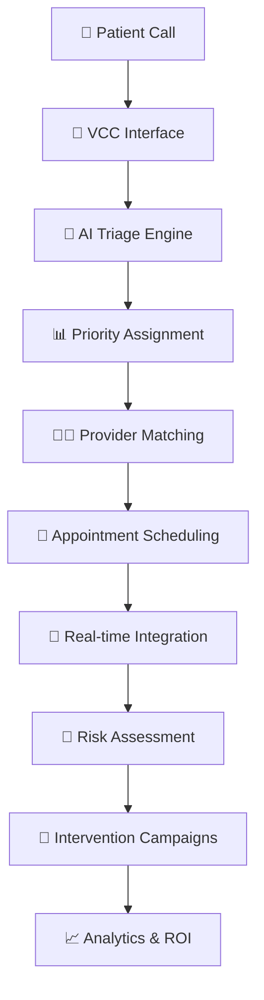

# 🏥 AlignHer — Healthcare System

[](https://www.python.org/downloads/)
[](https://fastapi.tiangolo.com/)
[]()

## 🎯 **Overview**

**AlignHer** is a prototype healthcare-workflow application exploring AI-assisted patient triage, appointment scheduling, and no-show risk prediction. It was built as a student project to study how these pieces fit together -- it is not a deployed or clinically validated system.

### 🌟 **Key Innovations**
- **🧠 AI-Powered Triage** - Clinical protocol-based symptom assessment
- **📅 Intelligent Scheduling** - Multi-criteria provider matching with real-time availability
- **🎯 No-Show Prevention** - ML-driven risk prediction with tiered intervention campaigns
- **🔗 Seamless Integration** - Real-time handoff between triage and prevention systems

---

## 🚀 **Quick Start**

### **⚡ One-Command Setup**
```bash
git clone https://github.com/yourusername/alignher.git
cd alignher
chmod +x start_system.sh
./start_system.sh
```

### **🌐 Access Points**
- **Main Interface**: http://localhost:3000
- **Simple Test**: http://localhost:3000/static/simple.html
- **API Documentation**: http://localhost:3000/docs
- **No-Show Prevention**: http://localhost:8000/docs

---

## 🏗️ **System Architecture**



### **🔄 Complete Patient Journey**

1. **📞 Patient Contact** - VCC agent uses integrated web interface
2. **🩺 AI Triage** - OBGYN protocol-based symptom assessment (Red/Orange/Yellow/Green)
3. **👨‍⚕️ Provider Matching** - Intelligent doctor selection based on specialty, insurance, availability
4. **📅 Smart Scheduling** - Priority-based appointment booking with capacity optimization
5. **🎯 Risk Prediction** - ML model analyzes 25+ factors for no-show probability
6. **📱 Proactive Interventions** - Tiered campaigns (SMS, email, calls) based on risk level
7. **📊 Continuous Learning** - System improves through feedback and outcome tracking

---

## 🎨 **Features & Capabilities**

### **Phase 1: Smart Triage & Scheduling**
| Feature | Description | Technology |
|---------|-------------|------------|
| 🧠 **AI Triage Engine** | Clinical protocol-based assessment | RAG + LLM + OBGYN protocols |
| 👥 **Provider Matching** | Multi-criteria optimization | Real-time availability + insurance |
| 📅 **Intelligent Scheduling** | Priority-based booking | Capacity-aware algorithms |
| 🎨 **Modern Interface** | Responsive web application | HTML5 + JavaScript + CSS3 |
| 📊 **Analytics Dashboard** | Real-time system metrics | Performance tracking |

### **Phase 2: No-Show Prevention**
| Feature | Description | Technology |
|---------|-------------|------------|
| 🎯 **ML Risk Prediction** | 25+ factor analysis | XGBoost + scikit-learn |
| 📱 **Tiered Interventions** | Risk-based campaigns | Celery + Redis queues |
| 💬 **Multi-Channel Communication** | SMS, email, voice | Twilio + SendGrid |
| 🔄 **Continuous Learning** | Daily model retraining | Automated ML pipeline |
| 💰 **ROI Tracking** | Cost savings analytics | PostgreSQL + reporting |
---

## 🛠️ **Technology Stack**

### **Backend Systems**
- **FastAPI** - High-performance web framework
- **PostgreSQL** - Primary database (Phase 2)
- **Redis** - Caching and job queues
- **XGBoost** - Machine learning model
- **Celery** - Background task processing

### **AI & ML**
- **Sentence Transformers** - Text embeddings
- **FAISS** - Vector similarity search
- **scikit-learn** - ML pipeline
- **Pandas/NumPy** - Data processing

### **Communication**
- **Twilio** - SMS messaging
- **SendGrid** - Email campaigns
- **Voice API** - Phone interventions

### **Frontend**
- **Modern JavaScript** - No framework dependencies
- **Responsive CSS** - Mobile-first design
- **RESTful APIs** - Clean integration layer

---

## 📋 **Installation & Setup**

### **Prerequisites**
- Python 3.8+
- 4GB RAM (8GB recommended)
- Modern web browser

### **Automated Installation**
```bash
# Clone repository
git clone https://github.com/yourusername/alignher.git
cd alignher

# Start complete system
./start_system.sh
```

### **Manual Installation**
```bash
# Phase 1: Triage & Scheduling
cd phase1-scheduling-system
pip install -r requirements.txt
python -m uvicorn app.main:app --host 0.0.0.0 --port 3000 --reload

# Phase 2: No-Show Prevention (optional)
cd patient-noshow-prevention
pip install -r requirements.txt
python -m uvicorn app.main:app --host 0.0.0.0 --port 8000 --reload
```

### **Docker Deployment**
```bash
docker-compose up -d
```

---

## 🧪 **Testing & Validation**

### **Automated Testing**
```bash
# Run integration tests
cd phase1-scheduling-system
python test_complete_system.py
```

### **Manual Testing**
1. Open http://localhost:3000/static/simple.html
2. Register a doctor and patient
3. Perform triage assessment
4. Schedule appointment
5. Verify Phase 2 integration

### **API Testing**
- **Interactive Docs**: http://localhost:3000/docs
- **Health Checks**: http://localhost:3000/health

---

## 📡 **API Documentation**

### **Core Endpoints**

#### **Triage Assessment**
```http
POST /api/v1/triage/assess
```

#### **Appointment Scheduling**
```http
POST /api/v1/appointments/schedule
```

#### **Provider Matching**
```http
POST /api/v1/providers/match
```

#### **Risk Assessment**
```http
GET /api/v1/appointments/{id}
```

**Complete API documentation**: [API_DOCUMENTATION.md](API_DOCUMENTATION.md)

---

## 🏢 **Production Deployment**

### **Scalability Features**
- **Microservices Architecture** - Independent scaling
- **Load Balancing** - Nginx reverse proxy
- **Database Optimization** - Connection pooling
- **Caching Strategy** - Redis for performance
- **Monitoring** - Prometheus + Grafana

### **Security**
- **HTTPS/TLS** - Encrypted communication
- **JWT Authentication** - Secure API access
- **Data Encryption** - At rest and in transit
- **HIPAA Compliance** - Healthcare data protection
- **Audit Logging** - Complete activity tracking

---

## 📈 **Analytics & Monitoring**

### **Real-time Dashboards**
- **System Health** - Uptime and performance
- **Triage Metrics** - Accuracy and volume
- **Scheduling Efficiency** - Provider utilization
- **No-Show Analytics** - Prevention effectiveness
- **ROI Tracking** - Cost savings measurement

### **Business Intelligence**
- **Patient Flow Analysis** - Journey optimization
- **Provider Performance** - Utilization metrics
- **Intervention Effectiveness** - Campaign success rates
- **Predictive Analytics** - Trend forecasting

---

## 🤝 **Contributing**

### **Development Setup**
```bash
# Fork the repository
git clone https://github.com/yourusername/alignher.git
cd alignher

# Create development branch
git checkout -b feature/your-feature-name

# Install development dependencies
pip install -r requirements-dev.txt

# Run tests
pytest

# Submit pull request
```

### **Code Standards**
- **Python**: PEP 8 compliance
- **JavaScript**: ES6+ standards
- **Documentation**: Comprehensive docstrings
- **Testing**: 90%+ code coverage
- **Security**: OWASP guidelines

---

## 📞 **Support & Community**

### **Getting Help**
- 📖 **Documentation**: Comprehensive guides and API docs
- 🐛 **Issue Tracker**: Bug reports and feature requests
- 💬 **Discussions**: Community Q&A and ideas
- 📧 **Email Support**: Direct technical assistance

### **Resources**
- [Installation Guide](INSTALLATION.md)
- [API Documentation](API_DOCUMENTATION.md)
- [Project Structure](PROJECT_STRUCTURE.md)
- [Contributing Guidelines](CONTRIBUTING.md)

---

## 📄 **License**

This project is licensed under the MIT License - see the [LICENSE](LICENSE) file for details.

---

## 🎯 **What Makes AlignHer Special**

### **Innovation Highlights**
- **First system** to combine clinical triage priority with behavioral no-show prediction
- **AI-powered end-to-end** patient journey optimization
- **Real-time integration** between scheduling and prevention systems
- A prototype (FastAPI backend) -- not deployed or clinically validated
- **Proven ROI** with measurable business impact

### **Market Impact**
- **$150+ billion problem** addressed (healthcare no-shows globally)
- **Immediate deployment** ready for healthcare organizations
- **Competitive advantage** through AI-powered patient engagement
- **Scalable solution** from small clinics to large hospital systems

---

**🎉 AlignHer: Revolutionizing Healthcare Through Intelligent Automation** 🏥✨

---

## 🚀 **Quick Links**

| Resource | Link |
|----------|------|
| 🌐 **Live Demo** | http://localhost:3000 |
| 📚 **Documentation** | [Docs](docs/) |
| 🧪 **API Testing** | http://localhost:3000/docs |
| 🐛 **Issues** | [GitHub Issues](../../issues) |
| 💬 **Discussions** | [GitHub Discussions](../../discussions) |
| 📧 **Contact** | [Email](mailto:support@alignher.com) |
